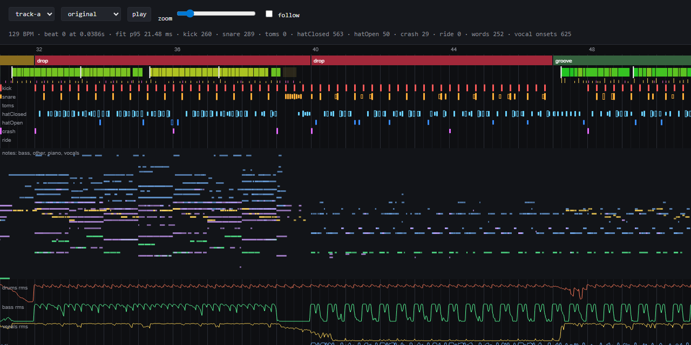

# fantasynth-tools

Offline analysis tools for Fantasynth, an instrument for real-time 3D visuals.

The instrument plays live. These tools run beforehand, on your own machine, and prepare
what it reads. Each tool lives in its own folder, with its own README.

## Tools

- [music-events](music-events/README.md). A finished track goes in. A timed list of its
  musical events comes out: beat grid, sections, drum hits, notes, energy curves, sung words. [Write-up](https://fantasynth.com/tools/music-events/).

  

## Licence

The code in this repo is MIT licensed. See [LICENSE](LICENSE).

The MIT licence covers this code only. Some tools download third-party models at runtime,
under their own terms. Several are non-commercial, or state no licence. Read each tool's
model licence notes before you use its output:

- music-events: [Model weights and licences](music-events/README.md#model-weights-and-licences)

Code ported from other projects is credited in [THIRD_PARTY_NOTICES.md](THIRD_PARTY_NOTICES.md).

## Audio stays out

Never commit audio, stems, model weights or generated output. Each tool keeps them in a
workspace folder outside the repo. The `.gitignore` is a safety net, not a policy.
